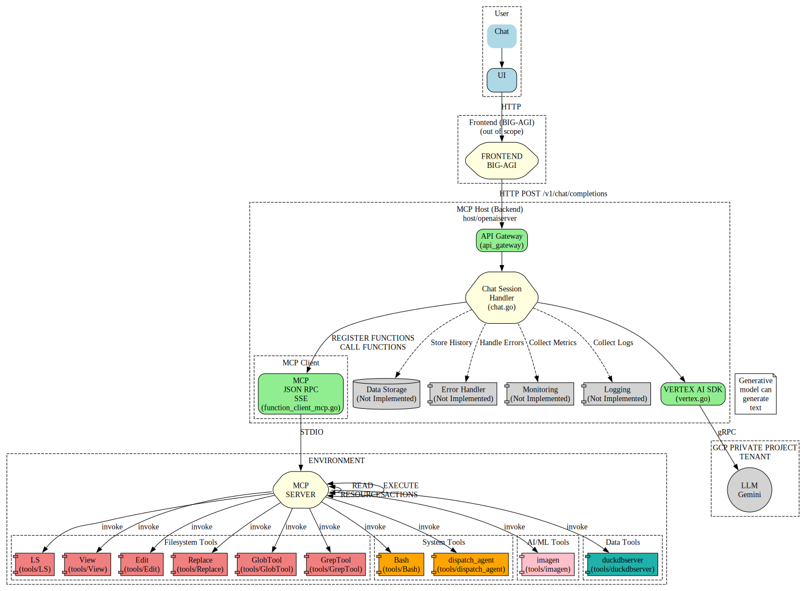

# gomcptest: Proof of Concept for MCP with Custom Host

This project is a proof of concept (POC) demonstrating how to implement a Model Context Protocol (MCP) with a custom-built host to play with agentic systems. The code is primarily written from scratch to provide a clear understanding of the underlying mechanisms.

[See the experimental website for documentation (auto-generated) at https://owulveryck.github.io/gomcptest/](https://owulveryck.github.io/gomcptest/)

## Goal

The primary goal of this project is to enable easy testing of agentic systems through the Model Context Protocol. For example:

- The `dispatch_agent` could be specialized to scan codebases for security vulnerabilities
- Create code review agents that can analyze pull requests for potential issues
- Build data analysis agents that process and visualize complex datasets
- Develop automated documentation agents that can generate comprehensive docs from code

These specialized agents can be easily tested and iterated upon using the tools provided in this repository.

## Prerequisites

- Go >= 1.21
- Access to the Vertex AI API on Google Cloud Platform
- `github.com/mark3labs/mcp-go`

The tools use the default GCP login credentials configured by `gcloud auth login`.

## Project Structure



-   **`host/openaiserver`**: Implements a custom host that mimics the OpenAI API, using Google Gemini and function calling. This is the core of the POC and includes the modern **AgentFlow** web UI.
-   **`host/cliGCP`**: CLI tool similar to Claude Code for testing agentic interactions. **⚠️ Note: This component is deprecated in favor of the AgentFlow web UI.**
-   **`tools`**: Contains various MCP-compatible tools that can be used with the host:
    - **Bash**: Execute bash commands
    - **Edit**: Edit file contents
    - **GlobTool**: Find files matching glob patterns
    - **GrepTool**: Search file contents with regular expressions
    - **LS**: List directory contents
    - **Replace**: Replace entire file contents
    - **View**: View file contents
    - **dispatch_agent**: Specialized agent dispatcher for various automated tasks
    - **imagen**: Image generation and manipulation using Google Imagen
    - **duckdbserver**: DuckDB server for data processing

## Components

#### Key Features

-   **OpenAI Compatibility:** The API is designed to be compatible with the OpenAI v1 chat completion format.
-   **Google Gemini Integration:** It utilizes the VertexAI API to interact with Google Gemini models.
-   **Streaming Support:** The server supports streaming responses.
-   **Function Calling:** Allows Gemini to call external functions and incorporate their results into chat responses.
-   **MCP Server Interaction:** Demonstrates interaction with MCP (Model Context Protocol) servers for tool execution.
-   **AgentFlow Web UI:** Modern, mobile-optimized web interface for testing agentic systems with natural language.
-   **Vertex AI Built-in Tools:** Support for Google's native tools including Code Execution, Google Search, and Google Search Retrieval.
-   **Template Engine:** Flexible template system supporting multiple deployment modes.

## Building the Tools

You can build all tools and servers using the root Makefile:

```bash
# Build all tools and servers
make all

# Build only tools
make tools

# Build only servers
make servers

# Run a specific tool for testing
make run TOOL=Bash

# Install binaries to a directory
make install INSTALL_DIR=/path/to/install

# Clean build artifacts
make clean
```

## Configuration

Set up the required environment variables for the host applications:

```bash
export GCP_PROJECT=your-project-id
export GCP_REGION=your-region
export GEMINI_MODELS=gemini-2.0-flash

# Optional: Enable Vertex AI built-in tools
export VERTEX_AI_CODE_EXECUTION=true
export VERTEX_AI_GOOGLE_SEARCH=true
export VERTEX_AI_GOOGLE_SEARCH_RETRIEVAL=true
```

Note: `IMAGEN_MODELS` and `IMAGE_DIR` are no longer needed for the hosts as imagen functionality is now provided by the independent MCP tool in `tools/imagen`.

## AgentFlow Web UI

**AgentFlow** is the modern web-based interface for interacting with the agentic system. It is **embedded directly in the openaiserver binary** and provides a professional, mobile-optimized chat experience with real-time streaming responses.

### Features
- **Mobile-First Design**: Optimized for iPhone and mobile devices with Apple touch icon support
- **Real-time Streaming**: Server-sent events for immediate response display
- **Professional Styling**: Clean, modern interface with gradient backgrounds
- **Conversation Management**: Persistent conversation history with easy navigation
- **Attachment Support**: Upload and manage files including PDFs
- **Embedded Architecture**: Built into the main openaiserver for easy deployment

### How to Access AgentFlow

Simply start the openaiserver and access the UI at the `/ui` endpoint:

```bash
./bin/openaiserver
# AgentFlow UI available at: http://localhost:8080/ui
```

That's it! No separate UI server needed - AgentFlow is embedded in the main binary.

### Development Note

The `simpleui` directory contains a standalone UI server used only for development and testing purposes. Regular users should use the embedded UI via `/ui` endpoint.

## Testing the CLI (Deprecated)

⚠️ **Note: The CLI tool is deprecated in favor of the AgentFlow web UI.**

You can still test the legacy CLI from the `bin` directory with:

```bash
./cliGCP -mcpservers "./GlobTool;./GrepTool;./LS;./View;./dispatch_agent -glob-path ./GlobTool -grep-path ./GrepTool -ls-path ./LS -view-path ./View;./Bash;./Replace;./imagen"
```

## Caution

⚠️ **WARNING**: These tools have the ability to execute commands and modify files on your system. They should preferably be used in a chroot or container environment to prevent potential damage to your system.

## Quickstart

This guide will help you quickly run the `openaiserver` located in the `host/openaiserver` directory.

### Prerequisites

*   Go installed and configured.
*   Environment variables properly set.

### Running the Server

1.  Navigate to the `host/openaiserver` directory:

    ```bash
    cd host/openaiserver
    ```

2.  Set the required environment variables.  Refer to the Configuration section for details on the environment variables.  A minimal example:

    ```bash
    export GCP_PROJECT=your-gcp-project-id
    export GCP_REGION=us-central1
    ```

3.  Run the server:

    ```bash
    go run .
    ```

    or

    ```bash
    go run main.go
    ```

    For testing with full event streaming (recommended for development):

    ```bash
    go run . -withAllEvents
    ```

The server will start and listen on the configured port (default: 8080).

## Configuration

The `openaiserver` application is configured using environment variables. The following variables are supported:

### Global Configuration

| Variable  | Description                       | Default | Required |
| --------- | --------------------------------- | ------- | -------- |
| `PORT`      | The port the server listens on    | `8080`  | No       |
| `LOG_LEVEL` | Log level (DEBUG, INFO, WARN, ERROR) | `INFO`  | No       |

### GCP Configuration

| Variable       | Description                                  | Default                   | Required |
| -------------- | -------------------------------------------- | ------------------------- | -------- |
| `GCP_PROJECT`  | Google Cloud Project ID                      |                           | Yes      |
| `GEMINI_MODELS` | Comma-separated list of Gemini models      | `gemini-1.5-pro,gemini-2.0-flash` | No       |
| `GCP_REGION`   | Google Cloud Region                          | `us-central1`             | No       |

### Vertex AI Built-in Tools

| Variable       | Description                                  | Default                   | Required |
| -------------- | -------------------------------------------- | ------------------------- | -------- |
| `VERTEX_AI_CODE_EXECUTION` | Enable Vertex AI Code Execution tool | `false` | No |
| `VERTEX_AI_GOOGLE_SEARCH` | Enable Vertex AI Google Search tool | `false` | No |
| `VERTEX_AI_GOOGLE_SEARCH_RETRIEVAL` | Enable Vertex AI Google Search Retrieval tool | `false` | No |

### OpenAI Server Command-Line Options

| Flag       | Description                                  | Default                   | Required |
| ---------- | -------------------------------------------- | ------------------------- | -------- |
| `-mcpservers` | Input string of MCP servers | | No |
| `-withAllEvents` | Include all events (tool calls, tool responses) in stream output, not just content chunks | `false` | No |

⚠️ **Important for Testing**: The `-withAllEvents` flag is **mandatory** for testing tool event flows in development. It enables streaming of all tool execution events including tool calls and responses, which is essential for debugging and development. Without this flag, only standard chat completion responses are streamed.

**Note**: `IMAGEN_MODELS` and `IMAGE_DIR` environment variables are no longer needed for the hosts. Image generation is now handled by the independent `tools/imagen` MCP server.

## Notes

-   This is a POC and has limitations.
-   The code is provided as is for educational purposes to understand how to implement MCP with a custom host.
